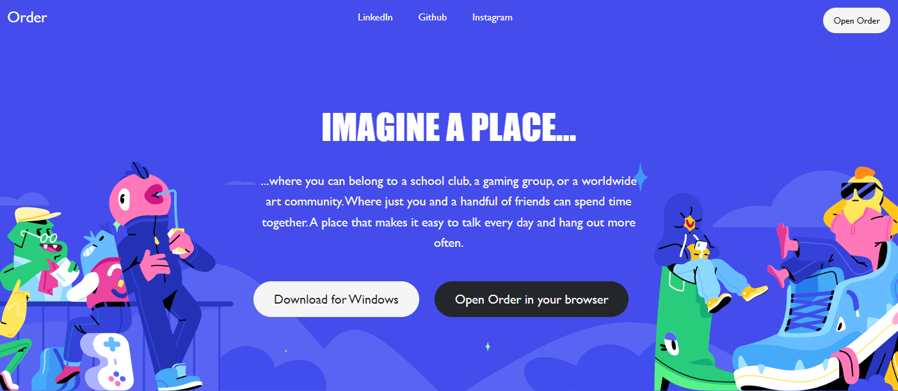
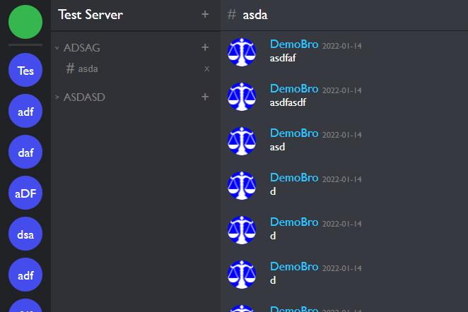

<h1>Order</h1>


<i>"In all chaos there is a cosmos, in all discord a secret Order."

--Carl Jung</i>

<br>


# Table of Contents #

* [About]
* [Technology Utilized]
* [Live Chat]
* [Code Related to Broadcasting]

## About 
---
<a h='https://app-order-vitovitch.herokuapp.com/#/'>Order</a> is a clone of Discord, an instant messaging application where users create and join servers to build their own communities. Inside of a server users can create and destroy categories, the folders which contain the server's channels. Inside of those categories users can create and destroy channels, and inside of those users can write and send messages to one another in real time!

## Technology Utilized ##
---
 * Ruby
 * Rails
 * React
 * Redux
 * Javascript
 * Redis/Websockets

 ## Live Chat <a name="Live"></a>
 ____

 

 Initially, there were a fair number of issues setting up and implementing the Live Chat Component. My initial approach was to create the websocket subscription at the server level which led to some complications when attempting to send data from deeply nested components. I got around this by implementing a subscription at the channel level and having the `create` function from the `MessagesController` make a broadcast to the appropriate channel whenever a message was saved. I then tied the `recieved` method of each channel subscription to the `fetchMessages` thunk action. Utilizing this framework of updating websocket servers on the completion of actions I plan on expanding Order's functionality.


 ## Code related to Broadcasting

 ```
 def create
        @message = Message.new(message_params)
        @message.author_id = current_user.id
        if @message.save
            chan = @message.channel.id
            message = [@message.server.id, @message.category.id, @message.channel_id]
            ActionCable.server.broadcast chan, messages: message
            render :show
        else 
            render json: @message.errors.full_messages, status: 422
        end
    end
 ``` 

